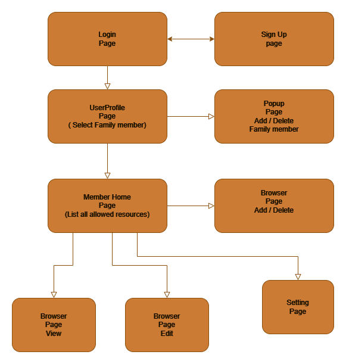

# Kid Web Browser for Android Pad 😄

Platform: Android && IOS

Languages: JavaScript

Framework: Expo Router & React Native

## Main Features:

1. Button list for web resources
2. Custom URL list for each web resource
3. Parent Control
4. No sleep screen
5. Login / register
6. Storge resources for each user
7. One resource include:\
   title, icon, defualt page, allow page list (inclue title or url keyword, or the whole specific url )
   Kid lock, full screen

## Pages:

- SignUp page
- Login page
- Member list page\
  List all member in family
- User home page\
  list the preset resources, each resource show at a card view with title detail and entry button and a custom button to add resources to this user. Share button to share the resources to others users.
- Web browser page (browser view and edit view)\
  Browser view just allow whitelist resource and show meno. If not allow page. it will go back to default page.
  Edit view has url bar and whitelist edit (add, edit delete whitelist and meno)

## Procedure



## Data Structure

```
#### Account List object ####

  const myAccount = {
    accountID: accountID,
    nickname: text_nickname,
    username: text_username,
    email: text_email,
    password: text_password,
  };

#### Account profile object ####

  const myAccountProfile = {
    owner: accountID,
    profile: {
      setting1: "aa",
      setting2: "bb",
    },
    memberlist: [
      {
        key: "0",
        title: "Add Person",
        description: "Add your kid or family member",
        icon: "https://alexlin1822.github.io/aimage/0.png",
        memo: "",
        status: "0",
      },
      // {...}
    ],
  };


#### Resource profile object ####

  const myResourceProfile = {
    owner: memberID,
    resourcelist: [
      {
        rid: "0",
        title: "Add resource",
        description: "Add resource",
        default_url: "https://www.google.com/",
        icon: "https://www.google.com/favicon.ico",
        memo: "",
        status: "0",
        url_include: "",
        title_include: "",
        whitelist: "",
        use_url_include: true,
        use_title_include: false,
        use_whitelist: false,
        last_url: "https://www.google.com/",
        time_limit: "30",
      },
      // {...}
    ],
  };
```

## This project is using Expo Router Framework

### Expo Router Example

Use [`expo-router`](https://expo.github.io/router) to build native navigation using files in the `app/` directory.

### 🚀 How to use

```sh
npx create-expo-app -e with-router
```

### 📝 More Resources & Documents

- [Expo Router: Docs](https://expo.github.io/router)
- [Expo Router: Repo](https://github.com/expo/router)
